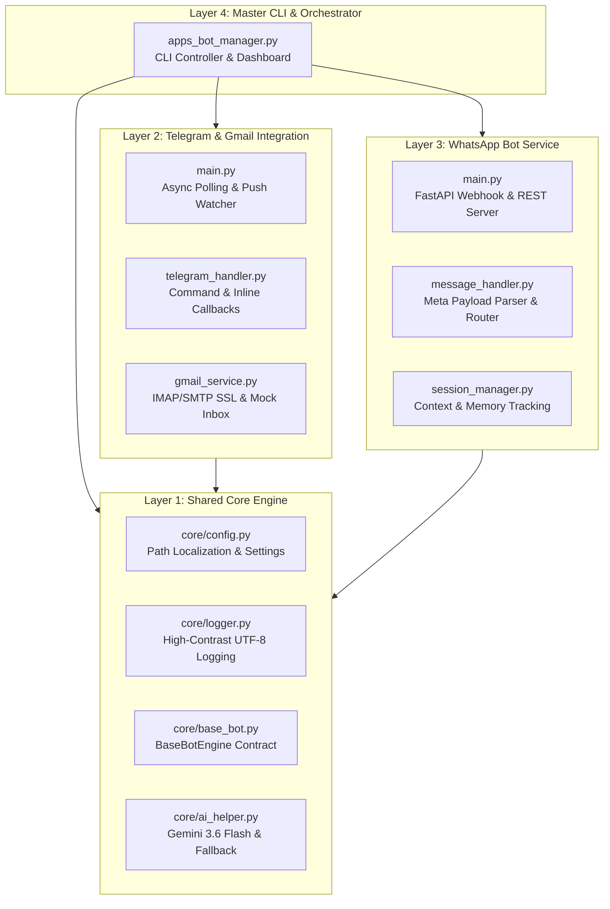

# 🤖 APPS_BOT - Ekosistem Bot Sistem Terpadu

> **Arsitektur Pembuatan, Pengembangan, dan Pemeliharaan Bot Multi-Platform**  
> Lokasi Proyek: `C:\Users\kafnu\Downloads\00-ANTIGRAVITY AI\00-APPS\02-APPS_BOT`  
> Standar Mutu: **Antigravity QC Protocol (Double-Check, Deep Dive, Verified)**

---

## 📑 Daftar Isi
1. [Ikhtisar Arsitektur](#-ikhtisar-arsitektur)
2. [Fitur Unggulan Modul](#-fitur-unggulan-modul)
   - [Layer 1: Shared Core Framework](#layer-1-shared-core-framework-core)
   - [Layer 2: Telegram Gmail Bot](#layer-2-telegram-gmail-bot-00-telegram_bot00-g-mail_bot)
   - [Layer 3: WhatsApp Bot](#layer-3-whatsapp-bot-01-whatsapp_bot)
   - [Layer 4: Orchestrator & CLI Manager](#layer-4-orchestrator--cli-manager)
3. [Panduan Penggunaan Cepat (Quick Start)](#-panduan-penggunaan-cepat-quick-start)
4. [Daftar Perintah & Cheatsheet](#-daftar-perintah--cheatsheet)
5. [Protokol Quality Control (QC) & Verifikasi](#-protokol-quality-control-qc--verifikasi)
6. [Pemeliharaan Jangka Panjang (Maintenance)](#-pemeliharaan-jangka-panjang-maintenance)

---

## 🏛️ Ikhtisar Arsitektur

Ekosistem **APPS_BOT** dirancang dengan prinsip modularitas tinggi, isolasi failure domain, serta resolusi path terlokalisasi relatif (`os.path.abspath(os.path.join(__file__, ...))`) untuk memastikan portabilitas tanpa ketergantungan path statis.



---

## 🌟 Fitur Unggulan Modul

### Layer 1: Shared Core Framework (`core/`)
* **Path & Environment Localization**: Semua modul membaca root directory relatif otomatis.
* **Console UTF-8 Protection**: Pencegahan `UnicodeEncodeError` pada terminal Windows dengan fallback encoding aman.
* **Rotating Log File**: Menyimpan riwayat log terstruktur ke `logs/apps_bot.log` hingga 10MB dengan 5 cadangan rotasi.
* **Gemini AI Integration**: Memanfaatkan model `gemini-3.6-flash` untuk ringkasan eksekutif dan saran draf balasan, dengan deterministic heuristic fallback ketika offline.

---

### Layer 2: Telegram Bot Ecosystem (`02-TELEGRAM_BOT/`)
* **00-GMAIL_BOT**: Bot pemantau Gmail multi-account (`pt.saudagar`, `8m.shop.online`, `kafnun84` Enclave).
  - **Asynchronous Polling**: Ringan dan responsif via `httpx` tanpa dependensi binary C-extension yang rapuh.
  - **Proactive Push Inbox Watcher**: Memantau kotak masuk secara berkala (default 60s) dan otomatis mengirim notifikasi instan ke chat Telegram yang diizinkan saat ada email baru.
  - **Kartu Email Interaktif**: Menampilkan subjek, pengirim, cuplikan isi, serta tombol inline (`⚡ Ringkas AI`, `📝 Draf Balasan`, `✅ Tandai Dibaca`).
  - **Kirim Email Langsung**: Perintah `/send` memudahkan membalas atau membuat email baru langsung dari chat Telegram.
  - **Zero-Crash Simulation Mode**: Dapat diuji secara langsung tanpa token/kredensial asli menggunakan seed inbox mock.
* **01-AI_CHAT_BOT**: Modul scaffolding untuk AI Chat Bot interaktif.
* **02-NEWS_BOT**: Modul scaffolding untuk bot Berita & Digest otomatis.
* **03-REMOTE_TV_BOT**: Modul scaffolding untuk bot Remote Android TV Box via ADB.
* **04-ROUTER_CTRL_BOT**: Modul scaffolding untuk bot Router/Mikrotik Network Ops.

---

### Layer 3: WhatsApp Bot (`01-WHATSAPP_BOT/`)
* **FastAPI Webhook Server**: Standar handshake Meta WhatsApp Cloud API (`hub.mode`, `hub.verify_token`, `hub.challenge`).
* **Dual Dispatcher & Automatic Failover**: Kebijakan *"Meta dahulu. Jika gagal, ke lokal gateway saja"*. Mengirim via Meta Cloud API resmi terlebih dahulu; jika token kadaluarsa atau Meta offline/error, otomatis beralih (*failover*) ke Local Gateway Bridge (`http://127.0.0.1:3000/api/send`).
* **Dual Format Parser**: Kompatibel dengan Meta WhatsApp Graph API resmi maupun HTTP bridge gateway lokal (Baileys/WPPConnect).
* **Conversational Session Manager**: Menyimpan riwayat 15 interaksi terakhir per nomor WhatsApp untuk menjaga konteks percakapan.
* **External REST API**: Endpoint `POST /api/send` memungkinkan sistem eksternal (seperti Postman, n8n, atau ERP) mengirim pesan WhatsApp secara terprogram.

---

### Layer 4: Orchestrator & CLI Manager (`apps_bot_manager.py`)
* **Pusat Kontrol Terpadu**: Satu perintah CLI untuk memeriksa status, menjalankan pengujian QC, atau mengeksekusi bot.
* **Multi-Process Concurrency**: Mampu menjalankan Telegram Bot dan WhatsApp Bot secara simultan (`python apps_bot_manager.py run all`).

---

## 🚀 Panduan Penggunaan Cepat (Quick Start)

### 1. Duplikasi Konfigurasi Lingkungan
Salin `.env.example` menjadi `.env`:
```powershell
cp .env.example .env
```

### 2. Diagnosis Status Lingkungan
Periksa kesiapan direktori dan kredensial:
```powershell
python apps_bot_manager.py status
```

### 3. Eksekusi Pengujian Otomatis (QC Suite)
Jalankan seluruh suite verifikasi mutu:
```powershell
python apps_bot_manager.py test
```

### 4. Menjalankan Bot

* **Menjalankan Telegram Gmail Bot:**
  ```powershell
  python apps_bot_manager.py run telegram
  ```

* **Menjalankan WhatsApp Bot Server:**
  ```powershell
  python apps_bot_manager.py run whatsapp
  ```

* **Menjalankan Seluruh Bot Bersamaan:**
  ```powershell
  python apps_bot_manager.py run all
  ```

---

## 📋 Daftar Perintah & Cheatsheet

### Telegram Gmail Bot
| Perintah | Deskripsi |
| :--- | :--- |
| `/start` atau `/help` | Menampilkan panduan dan status integrasi bot |
| `/unread` atau `/inbox` | Mengambil email belum dibaca dan menampilkan kartu interaktif |
| `/status` | Cek status engine, koneksi Gmail, dan model AI |
| `/summarize <ID>` | Ringkasan isi email dengan Gemini 3.6 Flash |
| `/draft <ID>` | Membuat draf balasan cerdas |
| `/send <to> \| <subjek> \| <pesan>` | Mengirim email melalui Gmail SMTP |

### WhatsApp Bot
| Kata Kunci / Event | Tindakan Sistem |
| :--- | :--- |
| `halo` / `menu` / `bantuan` | Menampilkan menu interaktif dan opsi layanan cepat |
| `status` | Informasi operasional server dan riwayat sesi pengguna |
| `email` / `cek email` | Tautan ringkas informasi status kotak masuk Gmail |
| `reset` | Mereset mesin percakapan pengguna |
| *Pertanyaan Bebas* | Otomatis dijawab oleh asisten AI |

---

## 🛡️ Protokol Quality Control (QC) & Verifikasi

Semua modul telah diuji dan divalidasi dengan hasil pengujian 100% OK:

| Modul Pengujian | Lokasi File Uji | Jumlah Test | Status |
| :--- | :--- | :---: | :---: |
| **Core Framework** | `core/tests/test_core.py` | 4 Tests | ✅ **PASSED** |
| **Telegram Gmail Bot** | `02-TELEGRAM_BOT/00-GMAIL_BOT/tests/test_gmail_bot.py` | 7 Tests | ✅ **PASSED** |
| **WhatsApp Bot** | `01-WHATSAPP_BOT/tests/test_whatsapp_bot.py` | 9 Tests | ✅ **PASSED** |
| **Total Pengujian** | - | **20 Tests** | ✅ **100% LOLOS** |

---

## 🔧 Pemeliharaan Jangka Panjang (Maintenance)

1. **Rotasi Log**: File log tersimpan di `logs/apps_bot.log` dan berotasi secara otomatis ketika mencapai 10MB.
2. **Pemulihan Koneksi IMAP**: `gmail_service.py` menggunakan timeout terstandar (15 detik) untuk mencegah proses menggantung (*hanging socket*).
3. **Penyelarasan Model AI**: Model AI default diselaraskan ke `gemini-3.6-flash` untuk menjamin kompatibilitas jangka panjang.
4. **Zero-Downtime Deployment**: Layanan WhatsApp berjalan di atas ASGI Uvicorn yang dapat diintegrasikan dengan reverse proxy Nginx / Cloudflare Tunnel / ngrok.

---

## 📄 Dokumen Konteks Ekosistem

Ekosistem APPS_BOT mengandalkan 5 dokumen konteks sebagai sumber kebenaran (*source of truth*) yang dibaca oleh `core/context_loader.py` secara runtime:

| Dokumen | Fungsi | Injeksi Ke |
|:--|:--|:--|
| **`SOUL.md`** | Persona, guardrails, dan core directives. Mendefinisikan identitas APM, F.O.R.G.E. methodology, dan Zero-Crash Policy. | AI system prompt, `/start` greeting, `@zero_crash` decorator |
| **`MEMORY.md`** | Architecture map, endpoint aktif, cloud state, multi-account live state, dan MCP tool gateways. | `/status` command, CLI diagnostics, Render env vars |
| **`USER.md` / `USER-v2.md`** | Profil pemilik, preferensi komunikasi, dan standar governance. | AI tone & style, response branding, Docker labels |
| **`SKILL.md`** | Prosedur klasifikasi email 5 langkah (Sanitize → Classify → Score → Action → Validate). | `ai_helper.classify_email()` procedural workflow |
| **`ANTIGRAVITY_PARALLEL_ORCHESTRATION-v2.md`** | Master System Directive untuk dekomposisi DAG, 9 Agent IDs (Alpha-Omega), Privacy Enclave, dan Git Shadow Worktrees. | `context_loader.get_orchestration()`, CLI `context`, multi-agent workflows |

### Perintah Manajemen Produksi (CLI)
```powershell
# Jalankan pengujian menyeluruh (100% Quality Control Passed)
python apps_bot_manager.py test

# Cek status sistem, kredensial, dan 3 akun operasional
python apps_bot_manager.py status

# Jalankan protokol pembersihan data simulasi (Zero-Simulation Protocol)
python apps_bot_manager.py purge

# Inspeksi seluruh dokumen konteks aktif
python apps_bot_manager.py context
```

---

## 👤 Author & Attribution

| Field | Detail |
|:--|:--|
| **Nama** | Kafnun Asep Nurhuda Al-Hakim |
| **Organisasi** | PT. Saudagar (`pt.saudagar@gmail.com`) |
| **Peran** | Software & Ecosystem Production Manager / System Architect |
| **Framework** | Antigravity AI IDE 2.5.5 |
| **Repositori** | [`ptsaudagar-oss/02-apps-bot`](https://github.com/ptsaudagar-oss/02-apps-bot) |

